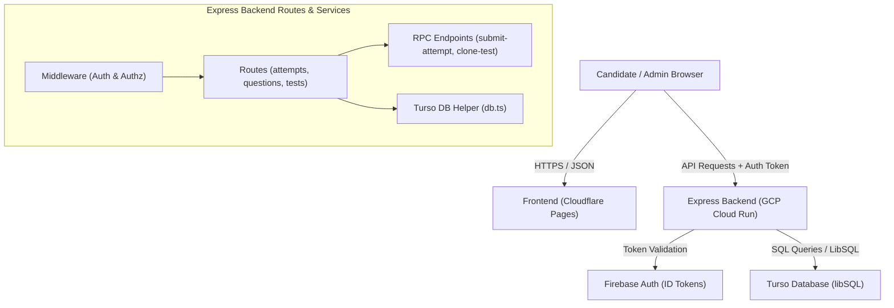

```mermaid
erDiagram
    clients {
        TEXT id PK
        TEXT name
        TEXT address
        TEXT logo_url
        INTEGER active_status
        TEXT created_at
        TEXT updated_at
    }
    profiles {
        TEXT id PK
        TEXT name
        TEXT email
        TEXT client_id FK
        TEXT created_at
        TEXT updated_at
    }
    user_roles {
        TEXT id PK
        TEXT user_id
        TEXT role
        TEXT client_id FK
    }
    question_folders {
        TEXT id PK
        TEXT client_id FK
        TEXT name
        TEXT parent_id FK
        TEXT created_at
        TEXT updated_at
    }
    questions {
        TEXT id PK
        TEXT client_id FK
        TEXT folder_id FK
        TEXT question_text
        TEXT option_a
        TEXT option_b
        TEXT option_c
        TEXT option_d
        TEXT correct_answer
        TEXT difficulty
        INTEGER marks
        TEXT created_at
        TEXT updated_at
    }
    test_folders {
        TEXT id PK
        TEXT client_id FK
        TEXT name
        TEXT created_at
        TEXT updated_at
    }
    tests {
        TEXT id PK
        TEXT client_id FK
        TEXT folder_id FK
        TEXT test_name
        INTEGER timer
        INTEGER shuffle
        INTEGER allow_review
        INTEGER negative_marking
        REAL negative_marks
        INTEGER restrict_navigation
        INTEGER attempts_allowed
        TEXT status
        INTEGER active
        INTEGER allow_guests
        TEXT scheduled_start
        TEXT scheduled_end
        TEXT share_code
        INTEGER public_link_enabled
        TEXT created_at
        TEXT updated_at
    }
    test_sections {
        TEXT id PK
        TEXT test_id FK
        TEXT name
        INTEGER position
        TEXT created_at
    }
    test_questions {
        TEXT id PK
        TEXT test_id FK
        TEXT question_id FK
        TEXT section_id FK
        INTEGER position
    }
    attempts {
        TEXT id PK
        TEXT student_id FK
        TEXT test_id FK
        REAL score
        REAL total_marks
        TEXT submitted_at
        INTEGER time_taken
        TEXT status
        TEXT ip_address
    }
    attempt_answers {
        TEXT id PK
        TEXT attempt_id FK
        TEXT question_id FK
        TEXT selected_option
        INTEGER marked_for_review
    }

    clients ||--o{ profiles : "has"
    clients ||--o{ user_roles : "has"
    clients ||--o{ question_folders : "owns"
    clients ||--o{ questions : "owns"
    clients ||--o{ test_folders : "owns"
    clients ||--o{ tests : "owns"

    profiles ||--o{ user_roles : "has"
    profiles ||--o{ attempts : "makes"

    test_folders ||--o{ tests : "groups"
    question_folders ||--o{ question_folders : "nested under"
    question_folders ||--o{ questions : "groups"

    tests ||--o{ test_sections : "contains"
    tests ||--o{ test_questions : "contains"
    tests ||--o{ attempts : "has"

    questions ||--o{ test_questions : "linked"
    questions ||--o{ attempt_answers : "answered"

    test_sections ||--o{ test_questions : "houses"

    attempts ||--o{ attempt_answers : "contains"
```

# System Architecture & Database Schema - NS Exam Portal

This document outlines the system architecture and database design of the NS Exam Portal. The current production implementation is a decoupled single-tenant/multi-tenant capable web application designed for high concurrency and performance.

---

## Tech Stack

| Layer | Technology | Details / Purpose |
| :--- | :--- | :--- |
| **Frontend** | React 18, TypeScript, Vite | Single Page Application (SPA) providing dashboards and assessment interface. |
| **Routing** | React Router v6 | Role-based layout structures and client-side page routing. |
| **Styling** | shadcn/ui + Tailwind CSS | Component library using Radix UI primitives and utility-first styling. |
| **Authentication** | Firebase Authentication | Anonymous authentication for guest users; credentials-based logins for students and admins. |
| **Backend** | Node.js, Express, TypeScript | REST API service containing business logic, middleware, and route handlers. |
| **Database** | Turso (libSQL) | Serverless relational database based on SQLite, designed for edge/regional distribution. |
| **Hosting (Backend)** | GCP Cloud Run | Containerized, scalable backend API deployed on Google Cloud Platform. |
| **Hosting (Frontend)** | Cloudflare Pages | Edge-hosted frontend distribution with custom domains. |

---

## Project Structure

```
exam-portal-ns/
├── backend/
│   ├── src/
│   │   ├── auth/
│   │   │   └── auth.ts                # Firebase ID token verification
│   │   ├── db/
│   │   │   └── db.ts                  # Turso db client initialization
│   │   ├── middleware/
│   │   │   ├── auth.ts                # Global Authentication context extractor
│   │   │   └── authz.ts               # Role-based route protectors
│   │   ├── routes/
│   │   │   ├── rpc/
│   │   │   │   ├── clone-test.ts      # Custom duplicate test handler
│   │   │   │   └── submit-attempt.ts  # Exam submission & grading logic
│   │   │   ├── attempts.ts            # Attempts management routes
│   │   │   ├── attempt-answers.ts     # Save answers routes
│   │   │   ├── clients.ts             # Tenant clients management routes
│   │   │   ├── create-user.ts         # User registration route (Firebase + Turso)
│   │   │   ├── profiles.ts            # User profile data routes
│   │   │   ├── question-folders.ts    # Category folders management
│   │   │   ├── questions.ts           # Question bank management routes
│   │   │   ├── stats.ts               # Admin reporting/analytics statistics
│   │   │   ├── test-folders.ts        # Test folder routes
│   │   │   ├── test-questions.ts      # Test question association route (GET with auth check)
│   │   │   └── tests.ts               # Test configurations management
│   │   ├── services/
│   │   │   └── roles.ts               # Role checks and tenant resolution helper
│   │   ├── validation/
│   │   │   └── schemas.ts             # Zod validation schemas
│   │   └── server.ts                  # Server entry point with CORS and rate limiters
│   ├── Dockerfile                     # Multi-stage production container build
│   └── loadtest.js                    # k6 performance evaluation script
├── frontend/
│   ├── src/
│   │   ├── components/                # Modular UI components (Auth, Theme, Common)
│   │   ├── contexts/
│   │   │   └── AuthContext.tsx        # Auth state (using Firebase SDK)
│   │   ├── integrations/
│   │   │   └── firebase.ts            # Client-side Firebase client initialization
│   │   ├── pages/                     # Routed pages (SuperAdmin, ClientAdmin, Student, Test)
│   │   ├── services/                  # API client handlers
│   │   ├── types/                     # Shared type interfaces
│   │   └── utils/                     # CSV parses & client side helpers
│   └── wrangler.toml                  # Cloudflare Pages deployment configuration
├── docs/                              # Project Documentation
└── cloudbuild.yaml                    # Google Cloud Build build pipeline script
```

---

## System Architecture Diagram

### Visual Diagram (Mermaid)


### Text Diagram (Fallback)
```
┌────────────────────────────────────────────────────────┐
│                     Browser (React)                    │
│                                                        │
│   ThemeProvider  ──►  AuthProvider  ──►  Router        │
│                                            │           │
│                    React Router v6 ◄───────┘           │
│                           │                            │
│    ┌────────────┬─────────┴──┬───────────┬─────────┐   │
│    │ SuperAdmin │ ClientAdmin│  Student  │  Guest  │   │
│    │ Dashboard  │ Dashboard  │ Dashboard │ Join    │   │
│    └────────────┴────────────┴───────────┴─────────┘   │
└───────────────────────────┬────────────────────────────┘
                            │ HTTPS (JSON + Auth Token)
┌───────────────────────────▼────────────────────────────┐
│                    GCP Cloud Run Backend               │
│                                                        │
│    ┌──────────────────┐            ┌──────────────┐    │
│    │  Express Server  │───────────►│  Firebase    │    │
│    │  (server.ts)     │            │  Auth (SDK)  │    │
│    └────────┬─────────┘            └──────────────┘    │
│             │                                          │
│             ▼                                          │
│    ┌──────────────────┐                                │
│    │  Turso DB Client │                                │
│    │  (@libsql)       │                                │
│    └────────┬─────────┘                                │
└─────────────┼──────────────────────────────────────────┘
              │ SQL queries
┌─────────────▼──────────────────────────────────────────┐
│                    Turso Database (libSQL)             │
│                                                        │
│    clients  ──►  profiles  ──►  attempts               │
│       │             │              │                   │
│       ▼             ▼              ▼                   │
│    tests ◄── test_questions ──► attempt_answers        │
└────────────────────────────────────────────────────────┘
```

---

## Database Schema

The Turso database schema matches the relational schema converted from the original PostgreSQL definition, modified to support SQLite-compatible datatypes and indexing.

### Tables

#### `clients`
Represents client organizations (tenants).
* `id` (TEXT, PK): Unique client UUID.
* `name` (TEXT): Client organization name.
* `address` (TEXT, Nullable): Office address.
* `logo_url` (TEXT, Nullable): URL path to organization logo.
* `active_status` (INTEGER): `1` for active, `0` for inactive (Default `1`).
* `created_at` (TEXT): Timestamp string (Default `datetime('now')`).
* `updated_at` (TEXT): Timestamp string (Default `datetime('now')`).

#### `profiles`
One row per registered user. Linked directly to Firebase Auth UID.
* `id` (TEXT, PK): Unique Firebase Auth UID.
* `name` (TEXT): Display name.
* `email` (TEXT): User email address.
* `client_id` (TEXT, Nullable): FK → `clients(id)` ON DELETE CASCADE. Null for `superadmin` users.
* `created_at` (TEXT): Timestamp string.
* `updated_at` (TEXT): Timestamp string.

#### `user_roles`
Holds roles assignments. Users can have multiple roles, but the system selects the highest priority: `superadmin > clientadmin > student`.
* `id` (TEXT, PK): Primary key.
* `user_id` (TEXT): Linked user UID.
* `role` (TEXT): CHECK constraint `role IN ('superadmin', 'clientadmin', 'student')`.
* `client_id` (TEXT, Nullable): FK → `clients(id)` ON DELETE CASCADE.
* **Constraints**: `UNIQUE(user_id, role)`.

#### `question_folders`
Organizes questions within the client's question bank.
* `id` (TEXT, PK): Folder UID.
* `client_id` (TEXT): FK → `clients(id)` ON DELETE CASCADE.
* `name` (TEXT): Folder name.
* `parent_id` (TEXT, Nullable): FK → `question_folders(id)` ON DELETE CASCADE (Supports nesting).
* `created_at` (TEXT): Timestamp.
* `updated_at` (TEXT): Timestamp.

#### `questions`
Multiple-choice questions belonging to a client tenant.
* `id` (TEXT, PK): Question UID.
* `client_id` (TEXT): FK → `clients(id)` ON DELETE CASCADE.
* `folder_id` (TEXT, Nullable): FK → `question_folders(id)` ON DELETE SET NULL.
* `question_text` (TEXT): Question body text.
* `option_a` (TEXT): Option A content.
* `option_b` (TEXT): Option B content.
* `option_c` (TEXT): Option C content.
* `option_d` (TEXT): Option D content.
* `correct_answer` (TEXT): CHECK constraint `correct_answer IN ('A','B','C','D')`.
* `difficulty` (TEXT, Nullable): Difficulty metadata string.
* `marks` (INTEGER): Points allocated (Default `1`).
* `created_at` (TEXT): Timestamp.
* `updated_at` (TEXT): Timestamp.

#### `test_folders`
Organizes exams within the client's test dashboard.
* `id` (TEXT, PK): Folder UID.
* `client_id` (TEXT): FK → `clients(id)` ON DELETE CASCADE.
* `name` (TEXT): Folder display name.
* `created_at` (TEXT): Timestamp.
* `updated_at` (TEXT): Timestamp.

#### `tests`
Exam configurations created by client administrators.
* `id` (TEXT, PK): Test UID.
* `client_id` (TEXT): FK → `clients(id)` ON DELETE CASCADE.
* `folder_id` (TEXT, Nullable): FK → `test_folders(id)` ON DELETE SET NULL.
* `test_name` (TEXT): Name of the exam.
* `timer` (INTEGER): Duration limit in minutes.
* `shuffle` (INTEGER): Randomize question sequence (`1` = true, `0` = false).
* `allow_review` (INTEGER): Review allowed after test submission (`1` = true, `0` = false).
* `negative_marking` (INTEGER): Deduction penalty active (`1` = true, `0` = false).
* `negative_marks` (REAL): Penalty deduction score per incorrect answer (Default `0`).
* `restrict_navigation` (INTEGER): Prevent backing up to previous questions (`1` = true, `0` = false).
* `attempts_allowed` (INTEGER): Allowed attempt limit per student (Default `1`).
* `status` (TEXT): CHECK constraint `status IN ('draft', 'published')`.
* `active` (INTEGER): Active status flag (Default `1`).
* `allow_guests` (INTEGER): Guest login allowed (`1` = true, `0` = false).
* `scheduled_start` (TEXT, Nullable): Start date-time string.
* `scheduled_end` (TEXT, Nullable): End date-time string.
* `share_code` (TEXT): Unique invite join code.
* `public_link_enabled` (INTEGER): Direct access link active (`1` = true, `0` = false).
* `created_at` (TEXT): Timestamp.
* `updated_at` (TEXT): Timestamp.

#### `test_sections`
Sections within a test to group questions (e.g. Section A, Section B).
* `id` (TEXT, PK): Section UID.
* `test_id` (TEXT): FK → `tests(id)` ON DELETE CASCADE.
* `name` (TEXT): Section header.
* `position` (INTEGER): Ordering sequence index.
* `created_at` (TEXT): Timestamp.

#### `test_questions`
Junction table linking tests to questions, ordering them within specific sections.
* `id` (TEXT, PK): Primary key UID.
* `test_id` (TEXT): FK → `tests(id)` ON DELETE CASCADE.
* `question_id` (TEXT): FK → `questions(id)` ON DELETE CASCADE.
* `section_id` (TEXT, Nullable): FK → `test_sections(id)` ON DELETE SET NULL.
* `position` (INTEGER): Question position order index.
* **Constraints**: `UNIQUE(test_id, question_id)`.

#### `attempts`
Tracks candidate test executions.
* `id` (TEXT, PK): Attempt UID.
* `student_id` (TEXT): User ID (linked to profile ID / anonymous student profile ID).
* `test_id` (TEXT): FK → `tests(id)` ON DELETE CASCADE.
* `score` (REAL, Nullable): Total score computed upon submission.
* `total_marks` (REAL, Nullable): Sum of all correct question marks.
* `submitted_at` (TEXT, Nullable): Submission timestamp string.
* `time_taken` (INTEGER, Nullable): Elasped time in seconds.
* `status` (TEXT): CHECK constraint `status IN ('in_progress', 'submitted')` (Default `'in_progress'`).
* `ip_address` (TEXT, Nullable): Candidate IP address.

#### `attempt_answers`
Saves candidate selected options for active or completed test attempts.
* `id` (TEXT, PK): Answer UID.
* `attempt_id` (TEXT): FK → `attempts(id)` ON DELETE CASCADE.
* `question_id` (TEXT): FK → `questions(id)` ON DELETE CASCADE.
* `selected_option` (TEXT, Nullable): CHECK constraint `selected_option IN ('A','B','C','D')`.
* `marked_for_review` (INTEGER): Flag to mark question for review (`1` = true, `0` = false).
* **Constraints**: `UNIQUE(attempt_id, question_id)` (Allows clean option updates).

---

## Entity Relationship Diagram

### Visual Diagram (Mermaid)


### Text Diagram (Fallback)
```
                       clients (1 per tenant)
                          │
         ┌────────────────┼────────────────┐
         │                │                │
      profiles        questions          tests
         │                │                │
         │                └───────┬────────┘
     attempts                     │
         │                  test_questions
         │
  attempt_answers ──► questions
```

---

## Performance Indexes

To support high concurrency lookups (such as k6 load tests and dashboard loads), the database schema utilizes the following SQLite indexes:

```sql
CREATE INDEX IF NOT EXISTS idx_user_roles_user_id         ON user_roles(user_id);
CREATE INDEX IF NOT EXISTS idx_user_roles_client_id       ON user_roles(client_id);
CREATE INDEX IF NOT EXISTS idx_profiles_client_id         ON profiles(client_id);
CREATE INDEX IF NOT EXISTS idx_questions_client_id        ON questions(client_id);
CREATE INDEX IF NOT EXISTS idx_questions_folder_id        ON questions(folder_id);
CREATE INDEX IF NOT EXISTS idx_tests_client_id            ON tests(client_id);
CREATE INDEX IF NOT EXISTS idx_tests_share_code           ON tests(share_code);
CREATE INDEX IF NOT EXISTS idx_tests_folder_id            ON tests(folder_id);
CREATE INDEX IF NOT EXISTS idx_tests_status               ON tests(status);
CREATE INDEX IF NOT EXISTS idx_tests_scheduled_start      ON tests(scheduled_start);
CREATE INDEX IF NOT EXISTS idx_attempts_student_id        ON attempts(student_id);
CREATE INDEX IF NOT EXISTS idx_attempts_test_id           ON attempts(test_id);
CREATE INDEX IF NOT EXISTS idx_attempt_answers_attempt_id ON attempt_answers(attempt_id);
CREATE INDEX IF NOT EXISTS idx_test_questions_test_id     ON test_questions(test_id);
CREATE INDEX IF NOT EXISTS idx_test_questions_section_id  ON test_questions(section_id);
CREATE INDEX IF NOT EXISTS idx_test_questions_position    ON test_questions(position);
CREATE INDEX IF NOT EXISTS idx_test_sections_test_id      ON test_sections(test_id);
CREATE INDEX IF NOT EXISTS idx_test_folders_client_id     ON test_folders(client_id);
CREATE INDEX IF NOT EXISTS idx_question_folders_client_id ON question_folders(client_id);
```

---

## Environment Variables

### Backend Configuration
The Express backend relies on these environment variables:

| Variable | Source | Description |
| :--- | :--- | :--- |
| `PORT` | System / GCP | Port bound to the server process (Default `8080`). |
| `TURSO_DATABASE_URL` | Secrets / `.env` | Turso database connection URL (`libsql://...`). |
| `TURSO_AUTH_TOKEN` | Secrets / `.env` | Authentication token for Turso cloud db. |
| `DISABLE_RATE_LIMITER` | Env Variable | Set to `true` to disable API rate limiting (used during stress tests). |
| `FIREBASE_PROJECT_ID` | Env Variable | Firebase project identifier for JWT verification. |
| `FIREBASE_CLIENT_EMAIL` | Env Variable | Client email for the Firebase service account. |
| `FIREBASE_PRIVATE_KEY` | Env Variable | Private key for the Firebase service account (handles user creations). |
| `NODE_ENV` | System | Environment flag (`production` or `development`). |
| `FRONTEND_URL` | Env Variable | Optional CORS origin parameter. |

### Frontend Configuration
The React Vite frontend relies on these environment variables:

| Variable | Source | Description |
| :--- | :--- | :--- |
| `VITE_API_URL` | Env Variable | Deployed Express server API endpoint url. |
| `VITE_FIREBASE_API_KEY` | Env Variable | Public Firebase SDK API key. |
| `VITE_FIREBASE_AUTH_DOMAIN` | Env Variable | Firebase Authentication domain config. |
| `VITE_FIREBASE_PROJECT_ID` | Env Variable | Firebase project ID config. |
| `VITE_FIREBASE_APP_ID` | Env Variable | Firebase App instance ID. |
