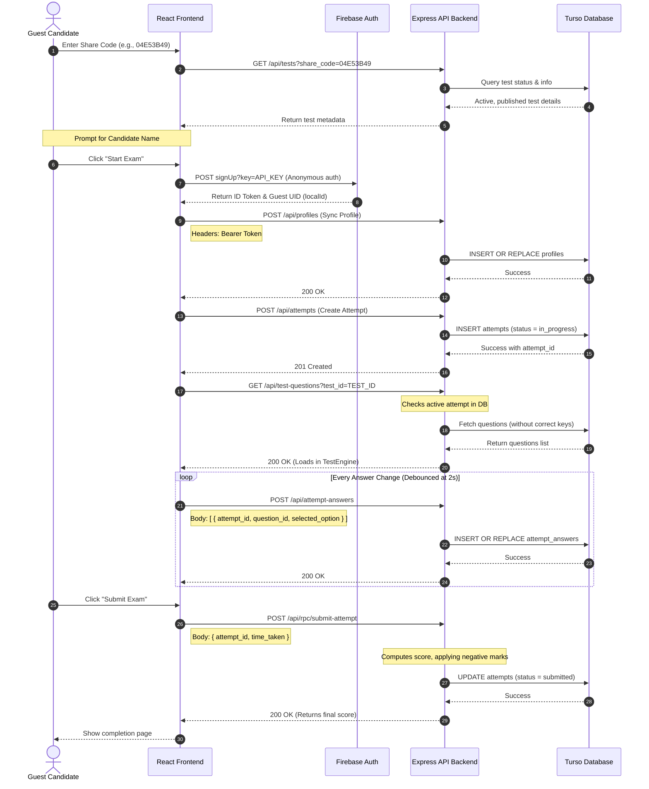

# Features & System Flows - NS Exam Portal

This document details the features, routing policies, and step-by-step API flows implemented in the NS Exam Portal application.

---

## Roles & Permissions

The platform supports a hierarchy of three primary user roles:

| Role | Hierarchy Priority | Description |
| :--- | :--- | :--- |
| `superadmin` | 1 | Platform owner. Manages all client organizations (tenants) and tenant administrators. |
| `clientadmin` | 2 | Client/Organization tenant admin. Manages organizational folders, student rosters, question banks, exams, and views performance analytics. |
| `student` | 3 | End user candidate. Takes exams assigned to their tenant and reviews completed test history. |

---

## Route Protection & Guard Policies

Frontend routing is managed via React Router v6. Protected pages are wrapped in a `<ProtectedRoute allowedRoles={[...]}>` layout component:
* If the user is unauthenticated, they are redirected to `/auth`.
* If the user has a primary role that is not in the allowed list, they are redirected to their default dashboard:
  * `superadmin` → `/superadmin`
  * `clientadmin` → `/client-admin`
  * `student` → `/student`

---

## Assessment Management & Test Builder

### Test Lifecycle
```
[Create Test] ──► Saved as [Draft] ──► (Optional) Move to Folder ──► [Publish] ──► [Active Test Engine]
```

Client administrators manage examinations with these features:
* **Interactive Test Builder**: A single-page visual canvas to configure test name, duration limit, and grading parameters (e.g. negative marking, shuffle order, and navigation locks).
* **Question Folders / Categorization**: Admins organize questions inside folder hierarchies. Questions can be imported into exams via folders or search query lookups.
* **Bulk Import via CSV**: Question lists can be imported client-side in bulk using CSV files.
* **Access Control settings**: Toggle guest student access (`allow_guests`) and schedule-active intervals (`scheduled_start` and `scheduled_end`).
* **Share Invite Links**: Generate an 8-character uppercase invite `share_code` and toggle direct URLs with automatically rendered QR codes.

---

## Step-by-Step Guest Candidate Exam Flow

Guest candidates join exams using a published invite share code without requiring a permanent registered account.

### Visual Flow (Mermaid)


### Text Flow (Fallback)
```
Guest Candidate              React Frontend             Firebase / Express / Turso
      │                            │                                 │
      ├─────── 1. Share Code ─────►│                                 │
      │                            ├────────── 2. GET /tests ───────►│ (Verify test)
      │                            ◄───────── 3. Test Config ────────┤
      │                            │                                 │
      ├───── 4. Start Exam ───────►│                                 │
      │                            ├───────── 5. signup (Anon) ─────►│ (Get ID Token)
      │                            ├───────── 6. POST /profiles ────►│ (Sync Candidate)
      │                            ├───────── 7. POST /attempts ────►│ (Create Attempt)
      │                            ├─────── 8. GET /test-questions ─►│ (Fetch Questions)
      │                            ◄─────── 9. Questions List ───────┤
      │                            │                                 │
      ├──── 10. Select Answer ────►│                                 │
      │                            ├───── 11. POST /attempt-answers ─►│ (Autosave answers)
      │                            │                                 │
      ├────── 12. Submit ─────────►│                                 │
      │                            ├───── 13. POST /submit-attempt ──►│ (Server-side grading)
      │                            ◄─────── 14. Final Score ─────────┤
      ◄────── 15. Done ────────────┤                                 │
```

---

## Detailed Guest Flow API Contracts

### 1. Share Code Verification
* **Endpoint**: `GET /api/tests?share_code=<CODE>`
* **Authentication**: None (Public)
* **Response (200 OK)**:
  ```json
  {
    "id": "ddb607e2-7fd0-41f5-b2f0-303853e09d6e",
    "client_id": "8ebacddb-d703-4c17-b368-a85c52827943",
    "test_name": "General Science Exam",
    "timer": 45,
    "shuffle": true,
    "allow_review": true,
    "negative_marking": false,
    "negative_marks": 0,
    "restrict_navigation": false,
    "attempts_allowed": 1,
    "status": "published",
    "active": true,
    "allow_guests": true,
    "share_code": "04E53B49",
    "public_link_enabled": true,
    "clients": {
      "name": "NS Software Solutions",
      "logo_url": "https://example.com/logo.png"
    }
  }
  ```

### 2. Firebase Anonymous Authentication
* **Endpoint**: `POST https://identitytoolkit.googleapis.com/v1/accounts:signUp?key=<FIREBASE_API_KEY>`
* **Headers**: `Referer: https://test.nssoftwaresolutions.in` (required to satisfy Firebase client configuration constraints)
* **Request Body**:
  ```json
  {
    "returnSecureToken": true
  }
  ```
* **Response (200 OK)**:
  ```json
  {
    "idToken": "eyJhbGciOi...",
    "email": "",
    "refreshToken": "...",
    "expiresIn": "3600",
    "localId": "firebase_anon_uid_12345"
  }
  ```

### 3. Sync Guest Profile
* **Endpoint**: `POST /api/profiles`
* **Headers**: `Authorization: Bearer <idToken>`
* **Request Body**:
  ```json
  {
    "id": "firebase_anon_uid_12345",
    "name": "GUEST: Candidate_15",
    "email": "guest_firebase_a_15@temp.exam",
    "client_id": "8ebacddb-d703-4c17-b368-a85c52827943"
  }
  ```
* **Response (200 OK)**:
  ```json
  {
    "success": true
  }
  ```

### 4. Create Active Attempt
* **Endpoint**: `POST /api/attempts`
* **Headers**: `Authorization: Bearer <idToken>`
* **Request Body**:
  ```json
  {
    "student_id": "firebase_anon_uid_12345",
    "test_id": "ddb607e2-7fd0-41f5-b2f0-303853e09d6e",
    "status": "in_progress"
  }
  ```
* **Response (201 Created)**:
  ```json
  {
    "id": "attempt_uuid_9999",
    "student_id": "firebase_anon_uid_12345",
    "test_id": "ddb607e2-7fd0-41f5-b2f0-303853e09d6e",
    "status": "in_progress",
    "ip_address": "127.0.0.1"
  }
  ```

### 5. Fetch Test Questions
* **Endpoint**: `GET /api/test-questions?test_id=ddb607e2-7fd0-41f5-b2f0-303853e09d6e`
* **Headers**: `Authorization: Bearer <idToken>`
* **Response (200 OK)**:
  *(Note: `correct_answer` is strictly omitted from the payload for security protection)*
  ```json
  [
    {
      "id": "tq_link_1",
      "test_id": "ddb607e2-7fd0-41f5-b2f0-303853e09d6e",
      "question_id": "27636f13-d57d-46e7-9095-bcd2c277c6af",
      "section_id": null,
      "position": 0,
      "section_name": "General Section",
      "questions": {
        "id": "27636f13-d57d-46e7-9095-bcd2c277c6af",
        "question_text": "What is the atomic number of Oxygen?",
        "option_a": "6",
        "option_b": "7",
        "option_c": "8",
        "option_d": "9",
        "marks": 1,
        "difficulty": "easy"
      }
    }
  ]
  ```

### 6. Save Candidate Answers (Debounced)
* **Endpoint**: `POST /api/attempt-answers`
* **Headers**: `Authorization: Bearer <idToken>`
* **Request Body**:
  ```json
  [
    {
      "attempt_id": "attempt_uuid_9999",
      "question_id": "27636f13-d57d-46e7-9095-bcd2c277c6af",
      "selected_option": "C",
      "marked_for_review": false
    }
  ]
  ```
* **Response (200 OK)**:
  ```json
  {
    "success": true
  }
  ```

### 7. Grade and Submit Attempt
* **Endpoint**: `POST /api/rpc/submit-attempt`
* **Headers**: `Authorization: Bearer <idToken>`
* **Request Body**:
  ```json
  {
    "attempt_id": "attempt_uuid_9999",
    "time_taken": 600
  }
  ```
* **Response (200 OK)**:
  ```json
  {
    "score": 1.0,
    "total_marks": 1.0,
    "time_taken": 600
  }
  ```

---

## Student Exam Flow
For registered student accounts, the exam flow follows an identical pattern to the guest flow, with the following modifications:
* **Lookup**: Active tests appear directly on the Student Dashboard (`GET /api/tests?client_id=CLIENT_ID`).
* **Attempt Limits**: Checked on initial load (`attempts_allowed`). The "Start Exam" UI action is locked if previous attempts exceed this limit.
* **Resume**: If a query to `GET /api/attempts` returns an `in_progress` attempt, the TestEngine loads that attempt ID instead of creating a new one, fetching previously saved answers to restore candidate state.

---

## Upgraded CSV Question Import System

The portal features a robust, validation-driven bulk import engine to upload questions directly into the bank or sections of a test.

### Features & Extensibility
* **Multiple Question Types Supported**: Parsed and validated dynamically:
  * `mcq`: Single correct option (A, B, C, or D), requiring exactly 4 options.
  * `true_false`: Exactly 2 options ("True" and "False"), correct answer is A or B.
  * `multi_select`: Minimum 2 options, correct answers split by pipe (e.g. `A|B|D`).
  * `fill_blank`, `subjective`, `coding`: Extensible fields.
* **High Performance Parsing**: Chunked inserts in batches of 100 to optimize write throughput on Turso.
* **Pre-Import Two-Stage Validation**:
  * **Stage 1 (Syntax Parsing)**: Catches malformed lines, missing required headers (`question_text`, `correct_answer`, `marks`), or column mismatch.
  * **Stage 2 (Business Logic)**: Runs validation constraints (marks limits, option bounds) and detects duplicate rows inside the CSV.
* **Transactional Batch Rollback**:
  * Every import session generates a UUID `import_batch_id`.
  * Users can undo/delete an entire import session in one click.
  * **Endpoint**: `DELETE /api/questions?import_batch_id=<BATCH_ID>`
* **Question Versioning (Option A)**:
  * Editing an imported question inserts a new question record with an incremented `version` number. Existing exam links remain bound to old version IDs to preserve audit trails of historical candidate submissions.

---

## Result Visibility & XLSX Performance Reports

Administrators have granular publishing control over when and how assessment metrics are released to candidates.

### Publishing Workflow
1. **Configurable settings per Test**:
   * `show_results_after_submission` (0 / 1): Controls whether score analytics are displayed on the frontend success screen.
   * `allow_report_download` (0 / 1): Toggles whether candidates can download performance spreadsheets.
   * `result_status` (`draft` / `published`): Master toggle for score visibility.
2. **Access Gates & Score Masking**:
   * Results are only visible to students/guests if `show_results_after_submission = 1` AND `result_status = 'published'`.
   * If unpublished, all GET responses and RPC submission responses strip `score` and `total_marks` to prevent score leakage.
   * Administrators and Super Admins retain full view access.

### Detailed Performance Reports
* **Endpoint**: `GET /api/attempts/:attemptId/report`
* **Authorization**:
  * Admins/Superadmins: Full download access.
  * Registered Owners: Authenticated request matching student user ID.
  * Guest Owners: Secure request using query parameter `?token=<ATTEMPT_TOKEN>` matching the attempt's generated token.
* **Spreadsheet Sheets (XLSX)**:
  1. **Summary Sheet**: Candidate Details, Marks, Time Taken, Accuracy %, and Date.
  2. **Detailed Questions**: Grid showing Q No, Question, options A-D, Chosen Answer, Correct Answer, Status (Correct / Wrong / Skipped), marks awarded, and Explanations.
  3. **Analytics**: Calculated performance graphs, average time spent per question, and correct answer ratio.

---

## Proctoring & Security Safeguards

To maintain assessment integrity and prevent cheating, the Test Engine implements the following client-side and server-side safeguards during active testing:

* **Fullscreen Enforcement**: Candidates must remain in fullscreen mode. Exiting fullscreen triggers a warning.
* **Tab-Switch & Navigation Monitoring**: The system monitors page focus changes (via `visibilitychange` events).
* **Violation and Auto-Submit System**: Exiting fullscreen or switching/hiding tabs increments a security violation counter. If a candidate registers **3 violations**, the exam auto-submits.
* **Auto-Submit & Auto-Save Timer**: When the duration timer reaches `0`:
  * The timer interval is cleared.
  * The system calls `handleSubmit(true)` to skip confirmation dialogs.
  * Debounced unsaved answers are automatically flushed and synced to the Turso database via `flushDirtyAnswers()` before the submit RPC is executed.
* **Copy-Paste Block**: Right-clicks (`contextmenu` events) and keyboard/mouse shortcuts for copying, cutting, and pasting (`copy`, `cut`, `paste`) are entirely blocked while taking an exam.
* **Visual Selection Lock**: CSS selection rules (`select-none`) block text highlight operations on exam contents.
